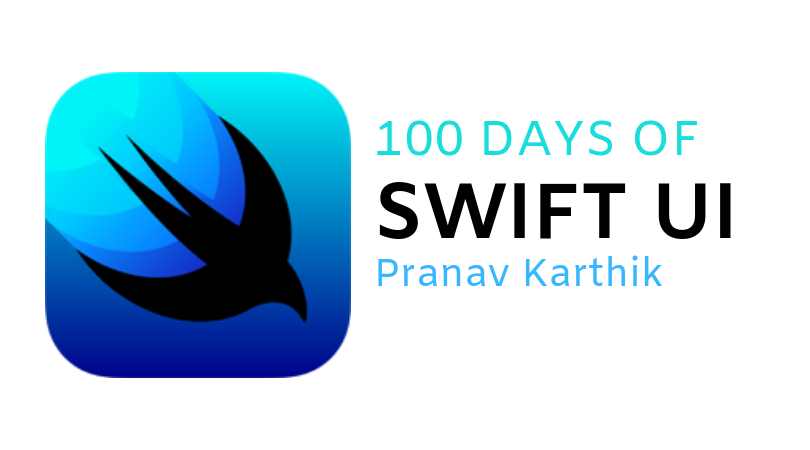

# 100DaysofSwiftUI
Welcome to my GitHub repository for all the projects I do during my #100DaysofSwiftUI challenge!

## What is SwiftUI?
Swift UI is Apple's new innovative framework for developing applications for all Apple platforms using the Swift Language. With a declarative Swift syntax that’s very simple to learn and powerful, SwiftUI works seamlessly with new Xcode design tools to keep your code and design perfectly in sync using Xcode previews. 

There's even automatic support for Dark Mode, Accessibility, and Localization which makes your SwiftUI code so much more powerful. 

## The Challenge
Everyday for a 100 days in total, I will build different projects using Swift UI to learn and experiment! Check out my [twitter](https://twitter.com/tech_pranav) for my updates on the #100DaysofSwiftUI challenge or follow the [#100DaysofSwiftUI](https://twitter.com/hashtag/100DaysOfSwiftUI?)

Each day has a markdown file which explains what the project is about.
